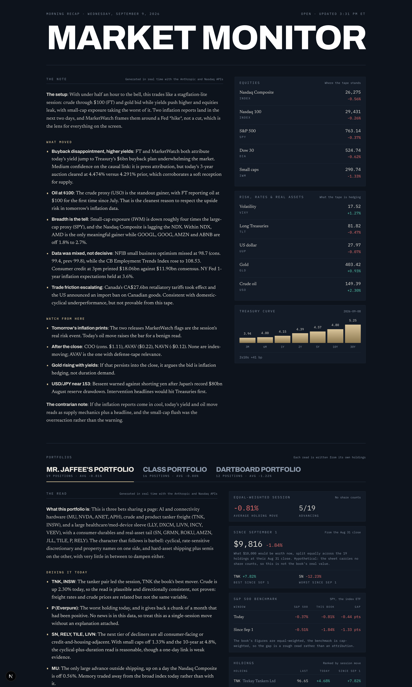

# Market Monitor

A US markets recap: one page that says where the tape stands, what prints
next, and what to watch, assembled from public data, with a written note from
Claude on top of it. The masthead and the note are framed for wherever the
session is (pre-open, intraday, after the close, weekend).



## Running it

```bash
npm install
npm run dev        # http://localhost:3000
```

Every number and headline works with no configuration. The written note needs a
Claude API key:

```bash
cp.env.example.env.local   # then paste your key into ANTHROPIC_API_KEY
npm run dev
```

Without a key the page renders in full and the note panels say the notes are off.

## What's on the page

| Section | What it shows |
| --- | --- |
| **The note** | Claude reads the full snapshot and writes a desk note: the setup, what moved, what to watch, and the most plausible way the read is wrong. It's framed for the session phase at the time of writing, which the panel states, and it is written on the server, so it is in the page's HTML. |
| **Indices** | Real index levels: S&P 500, Dow, Nasdaq Composite, Nasdaq 100, Russell 2000 and the VIX. |
| **Rates, dollar & commodities** | ETF share prices (TLT, UUP, GLD, USO), labelled as ETFs rather than presented as spot levels. |
| **Treasury curve** | The par yield curve at seven maturities, plus the 2s10s spread. |

### On the portfolios

Holdings are defined in `src/lib/portfolios.ts`. Every ticker was resolved
against Nasdaq's symbol lookup rather than from memory, and all 45 return a
live quote (note that "Everpure Inc" is the symbol `P`).

The sheets carry no share counts, so the app cannot compute a portfolio return
and does not pretend to. What it shows is an equal-weighted read of the session:
the average holding move and the advance/decline count, labelled as such on the
page and in the prompt.

Every book's note is written on the server along with the desk note, so all
three are in the page's HTML whichever tab is open.

### Since September 1

Each holding also carries its move since the start of September, measured from
the last close before the 1st (the standard month-to-date base), fetched from
Nasdaq's daily history and cached for six hours since a settled close does not
change. The date lives in `SINCE_DATE` in `src/lib/portfolios.ts`: change that
one line to re-point the window, or set it to the first of the current month to
make it roll.

Each tab also carries an S&P 500 benchmark panel: the index's move in both
windows, the book's own figures beside it, and the gap in points. Nasdaq's
quote API does not carry the index itself, so the benchmark is SPY and the
panel names the proxy. The book is equal-weighted and the index is
cap-weighted, so the gap is a rough read rather than an attribution, and both
the panel and the note say so.

Because there are still no share counts, the dollar figure is explicitly a
hypothetical: what $10,000 split equally across the priced holdings at that
close would be worth now. The page says so under the number, and the prompt
forbids the note from calling it the portfolio's value.

## Where the data comes from

All sources are public and keyless.

| Data | Source |
| --- | --- |
| Index levels: S&P 500, Dow (as DJX × 100), Russell 2000, VIX; fallback for Nasdaq 100 | `cdn.cboe.com` delayed quotes |
| Nasdaq indices, ETFs, stock quotes, movers, economic calendar, earnings calendar | `api.nasdaq.com` |
| Treasury par yield curve | `home.treasury.gov` XML feed |
| FX | `api.frankfurter.dev` |
| Crypto | `api.coingecko.com` |
| Headlines | CNBC Markets, CNBC Economy, MarketWatch, FT Markets, Federal Reserve press releases |

Two things worth knowing about the tape:

- **Every index row is a real index level.** Nasdaq's quote API only carries
  its own indices, so the rest come from Cboe. If every index source for a row
  is down, the row falls back to its ETF, is relabelled as the ETF (for example
  "S&P 500 ETF"), and the footer names the gap. A quote whose last trade is
  more than five days old is treated as missing: Cboe's own `^DJI` and `^COMP`
  quotes stopped updating long ago but still answer, which is why the Dow is
  read from DJX.
- **Treasuries, the dollar, gold and crude are ETF prices.** No free, keyless
  feed carries those spot levels, so the second panel is labelled as ETFs.
  USO and UUP hold rolling futures and track their underlying only loosely;
  Claude is told this and is told never to quote an ETF price as a spot level.
- **Prices are delayed at the source.** This is a recap, not a trading
  screen.

The economic and earnings calendars, the market movers, FX, crypto and the
headline feeds are no longer shown as panels. They are still fetched, because
the written notes read them for context, and the footer credits them.

Any source can rate-limit or change shape. Each fetch fails to `null` rather
than throwing, so one bad feed degrades one panel; the footer names anything
that didn't respond on that run.

## How it's wired

```
src/lib/       http.ts      fetch wrapper: browser UA, timeout, Next data cache
               note.ts      writes the notes with Claude, cached server-side
               prompts.ts   the notes' system prompts
               market.ts    quotes, Treasury curve, movers, FX, crypto
               calendar.ts  economic releases + earnings, keyed to the ET date
               news.ts      RSS parsing and dedupe
               snapshot.ts  one fan-out across all of it, plus the text
                            rendering that Claude reads
src/app/       page.tsx     server component: renders the snapshot
               api/refresh/ scheduled rewrite of the notes (Vercel Cron)
src/components/             the panels
```

The page is an ISR route revalidating every 5 minutes (`REVALIDATE` in
`src/lib/http.ts`). Every upstream fetch shares the Next data cache, so the page
and the notes read identical numbers without paying for the fetches twice.

The notes are written on the server and rendered into the page, so they are
there on first paint, for crawlers, and with JavaScript off. They are written
**once each weekday morning**, not per visit and not on a timer: each note is
held in the Next data cache (`unstable_cache`, tagged `notes`, no expiry), and
the only thing that rewrites them is a Vercel Cron job (`vercel.json`) calling
`/api/refresh` at 12:30 UTC, Monday to Friday. Every visitor between runs reads
the cached morning note, so the API key is billed four calls a day (the desk
note plus three books). If a rewrite fails (API error, refusal, truncation,
timeout) the previous note stays. The one other rewrite is the first render
after a deploy that changes `src/lib/note.ts`, which starts with an empty cache.

12:30 UTC is 8:30 AM Eastern during daylight time and 7:30 AM in winter. On
Vercel's Hobby plan a cron job can fire at any point within its scheduled hour.

They run `claude-sonnet-5` with adaptive thinking at low effort and declare
server-side refusal fallbacks, so a declined request routes to another model.

## Deploying

Deploys to Vercel as-is. Set `ANTHROPIC_API_KEY` in the project's environment
variables for the notes, and `CRON_SECRET` (any random string) to turn on the
scheduled refresh; without it `/api/refresh` answers 401. Nothing else is
required, and there is no database.

Not investment advice.
